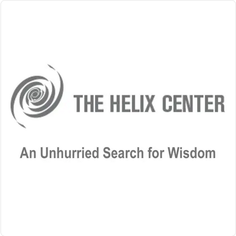

# The Helix Center Transcripts

The Helix Center Roundtable Transcripts

Transcripts in the folder [transcripts_txt] were generated by:

* Download bestaudio using pytube
* OpenAI Whisper base.en transcription

# About

The original inspiration for interdisciplinary forums arose from the observations by our director, Dr. Edward Nersessian, of the constraints in both communication and creativity among scientists at professional meetings, fueled both by narrow specialization and the grant process, that with its demand for sharply defined investigation seemed, in fact, to be limiting curiosity and inquiry. This motivated him to form discussion groups drawing on multiple disciplines, the creative productivity of which inspired the formation of the Philoctetes Center for the Multidisciplinary Study of the Imagination.

Dr. Nersessian’s success as co-founder and co-director of Philoctetes led him to spearhead the founding of the Helix Center for Interdisciplinary Investigation to carry this objective even further.

The primary objective of The Helix Center for Interdisciplinary Investigation is not to obtain knowledge, per se, but to aspire to an unhurried search for wisdom, emphasizing the centrality of a sense of wonder in this endeavor.

Philosophically, we stand against the trivialization of thought and the balkanization within and between the sciences and the arts. Fundamental to our promotion of these views is our roundtable format of open, spontaneous discourse, one facilitating novel encounters of questioning and understanding among participants. Each program endeavors to expand the boundaries of inquiry by facilitating a creative encounter with uncertainty in the face of scientific and artistic advances. To further nurture opportunities for creative social and intellectual exchange, we also sponsor musical performances, poetry readings, film screenings, and other opportunities for imaginative experience.

Our center becomes a kind of university without walls, one that draws together leaders of various disciplines irrespective of their academic affiliation, providing global access through our live streamed and archived events.

# Mission

The primary mission of The Helix Center is to draw together leaders from distinct spheres of knowledge in the arts, humanities, sciences, and technology for interdisciplinary roundtables, the unique format of which potentiates new ideas, new questions, and facilitates emergent creative qualities of mind less possible in conventional collaborations. Such a drawing together of leaders of various disciplines irrespective of their academic affiliation allows the Helix Center to function as a kind of university without walls. In addition, through audience attendance and its Q&A engagement with the roundtable participants, and live streamed and archived events, we aim to expand public understanding and appreciation of the sciences and technology, the arts and humanities.

Its accompanying website engages a global community in high-level discourse through live webcasts and continuing discussions arising from each roundtable.

The Helix Center also provides educational outreach through poetry discussions and music programs made available to teachers and schools.

The center is a 501(c)(3)–i.e., tax-exempt, non-profit–organization.

# Contact

The Helix Center
247 East 82nd Street
New York, NY 10028 